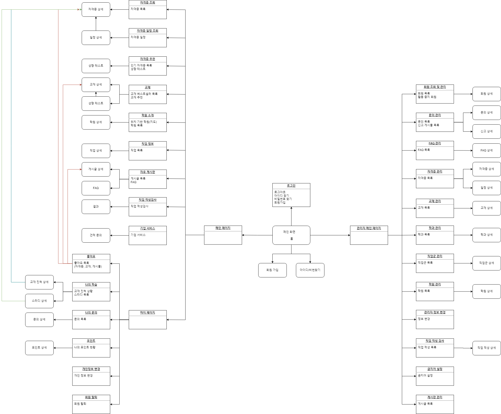
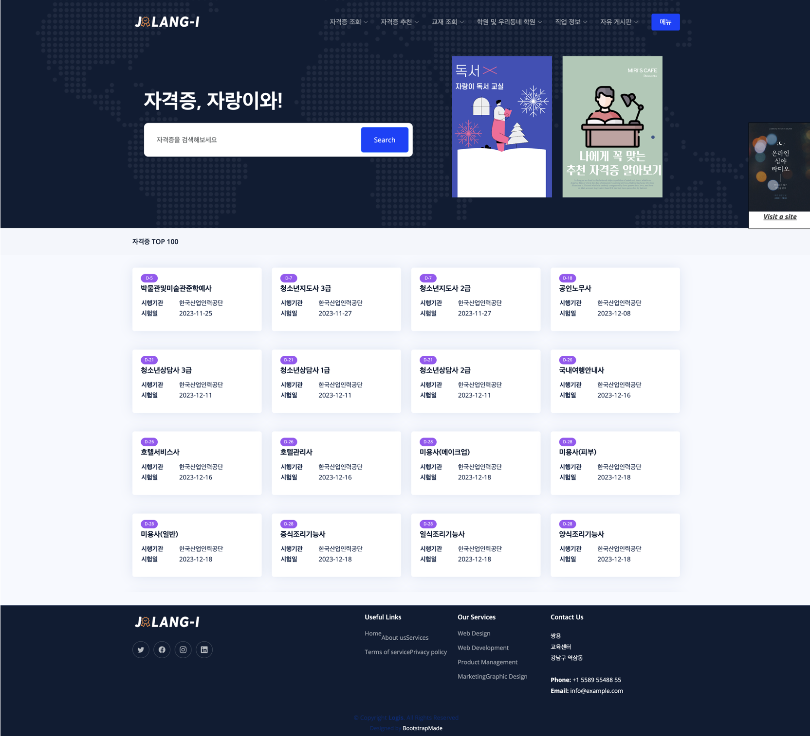
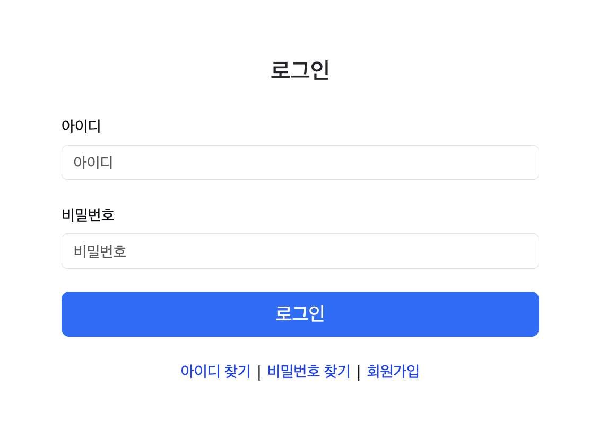
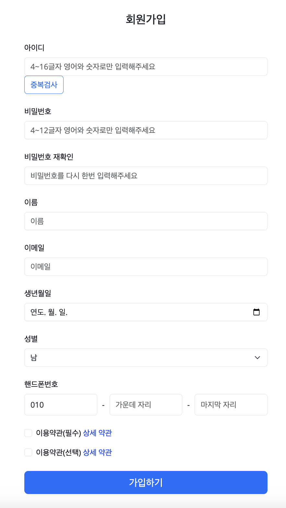
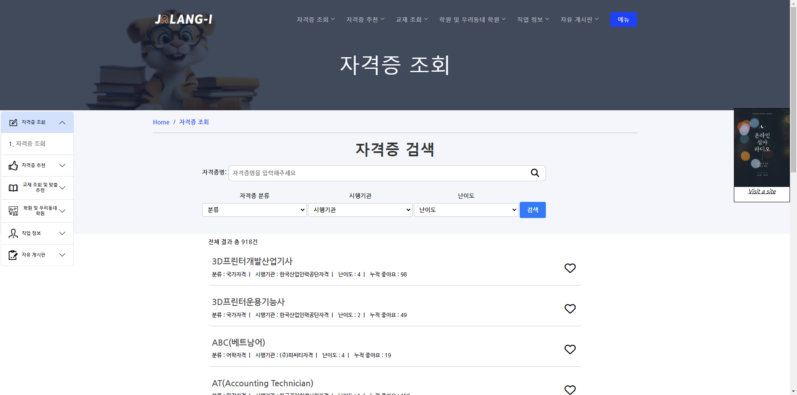
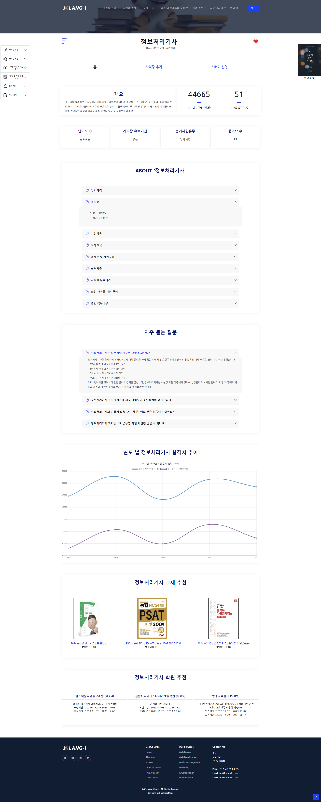

# :office: 자격증 정보 관리 시스템
....
# 1. 기획 의도
**정보 제공** : 자격증에 대한 종합정보(시험일, 시험과목, 응시료 등)을 제공합니다. 
**추천 서비스** : 직무에 따른 자격증 추천 서비스를 제공합니다 
**스터디** : 자격증 관련 질문 및 의견을 공유하며 서로의 지식과 경험을 소통 합니다. 
**기술** : Servlet+JSP 기반으로 Oracle로 데이터 관리를 하여 정보를 제공하는 프로젝트 입니다.

# 2. 🛠개발 환경
 
    

# 3. 👯‍♂️역할 분담
- 김수진 : My스터디, My교재학습, My자격증, 직업검색 
- 김혜민 : 사이드바, 헤더, 광고배너 디자인 
- 염현빈 : 회원가입, 로그인, 로그아웃, 아이디찾기, 비밀번호 재설정 
- 오승현 : 자유게시판, FAQ, QNA  
- 이도훈 : 자격증관리, 시험관리, 일정관리, FAQ관리, 금지어 관리 
- 이슬아 : 교재조회, My교재등록, 학원조회 
- 허수경 : 자격증조회, 자격증 스터디 신청, 자격증 후기, 자격증 일정, 자격증 추천 
- 황유진 : 메인화면, 관리자 메인화면, 학원관리 

# 4. 데이터 구조
## 1. 순서도
> 

## 2. eXERD
> 

# 5. 기능 구현
## 1. 초기 화면
> - main page  
> 
> - login page  
> 
> 

## 2. 기능 화면
> - 자격증 조회 
> 
> 
> - 관리자-신규 과목 등록 
> 
> 
> - 관리자-면접-추가 
> 
> - 관리자-면접-수정 
> 
> - 관리자-면접-삭제 
> 
> - 교사-강의스케줄 조회  
> 
> 
> - 교육생-성적조회  
> 
> 

# 6. 📜세부 일정
> <strong>9월 8일 ~ 9월 12일</strong> 
>> - 요구 분석
>> - 순서도
>> - ERD 

> <strong>9월 11일 ~ 9월 14일</strong> 
>> - 테이블 정의서 작성(DDL)
>> - 더미 데이터 
>> - 데이터 정의서 작성 

> <strong>9월 14일 ~ 9월 17일</strong> 
>> - PL/SQL, ANSI/SQL 작성
>> - 데이터 통합 및 디버깅
>> - PPT 작성 

> <strong>9월 18일</strong> 
>> - 발표  
  
  # 핵심 트러블 슈팅

 <strong>1. 더미 데이터 작성과 유효성 검사가 오래 걸렸다.</strong> 

  - 출결 더미 데이터가 약 7만개 였고 그 데이터들을 insert문으로 바꾸는데 시간이 오래 걸렸다. 하지만 자바 파일 입출력으로 한번 코드를 짜 놓아 시간이 그나마 단축 되었다.  

 <strong>2. 익숙치 않은 PL/SQL에서 시간이 오래 걸렸다.</strong> 

  - PL/SQL이 자바와 비교하자면 변수,메소드,조건문등을 구현할 수 있는 코드 인데 사용법이 익숙치 않아 CRUD만 하는데도 오래 걸렸다  

# 그 외 이슈

<strong>
  </strong> 

  

  
  

  
