# :office: 자격증 정보 관리 시스템
....
# 1. 기획 의도
**정보 제공** : 자격증에 대한 종합정보(시험일, 시험과목, 응시료 등)을 제공합니다. 
**추천 서비스** : 직무에 따른 자격증 추천 서비스를 제공합니다 
**스터디** : 자격증 관련 질문 및 의견을 공유하며 서로의 지식과 경험을 소통 합니다. 
**기술** : Servlet+JSP 기반으로 Oracle로 데이터 관리를 하여 정보를 제공하는 프로젝트 입니다.

# 2. 🛠개발 환경
 
    

# 3. 👯‍♂️역할 분담
- 김수진 : My스터디, My교재학습, My자격증, 직업검색 
- 김혜민 : 사이드바, 헤더, 광고배너 디자인 
- 염현빈 : 회원가입, 로그인, 로그아웃, 아이디찾기, 비밀번호 재설정 
- 오승현 : 자유게시판, FAQ, QNA  
- 이도훈 : 자격증관리, 시험관리, 일정관리, FAQ관리, 금지어 관리 
- 이슬아 : 교재조회, My교재등록, 학원조회 
- 허수경 : 자격증조회, 자격증 스터디 신청, 자격증 후기, 자격증 일정, 자격증 추천 
- 황유진 : 메인화면, 관리자 메인화면, 학원관리 

# 4. 데이터 구조
## 1. 순서도
> 

## 2. eXERD
> 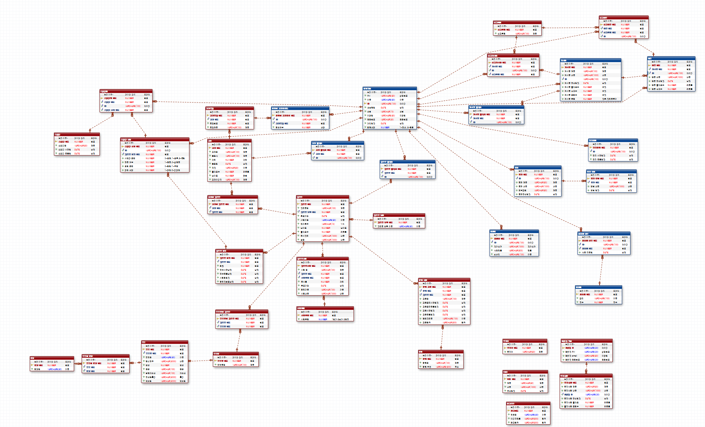

# 5. 기능 구현
## 1. 초기 화면
> - main page  
> 
> - login page  
> 
> 

## 2. 기능 화면
> - 자격증 조회 
> 
> 
> - 자격증 추천 
> 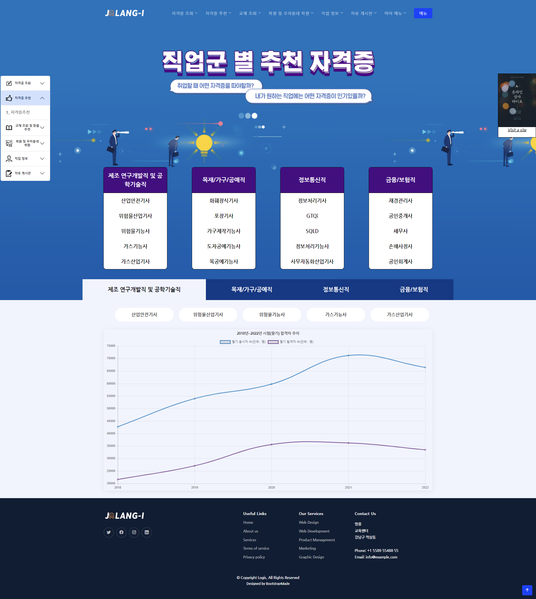
> - 교재 조회 
> 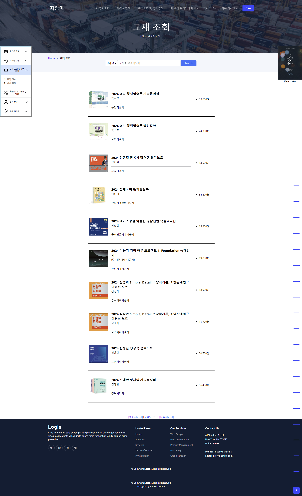
> 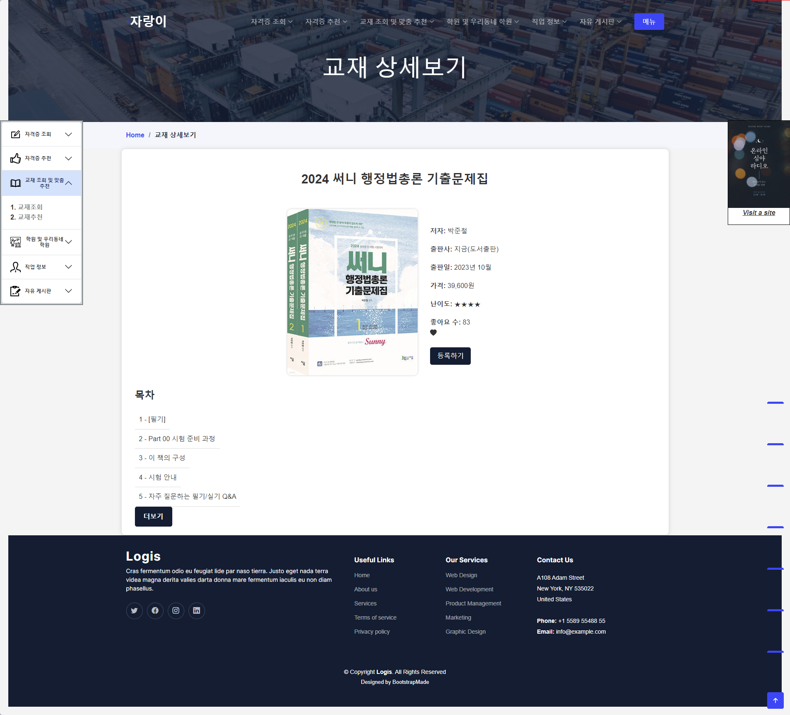
> - 학원 조회 
> 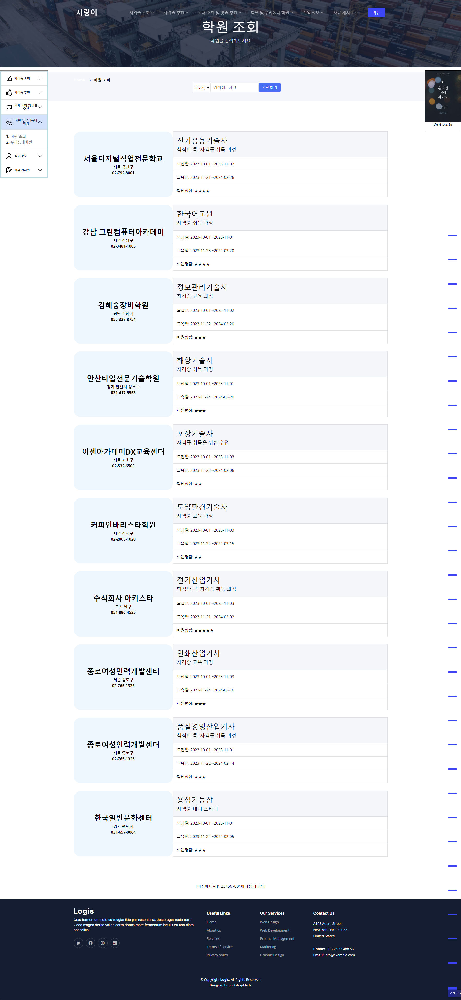
> - 직업 조회 
> 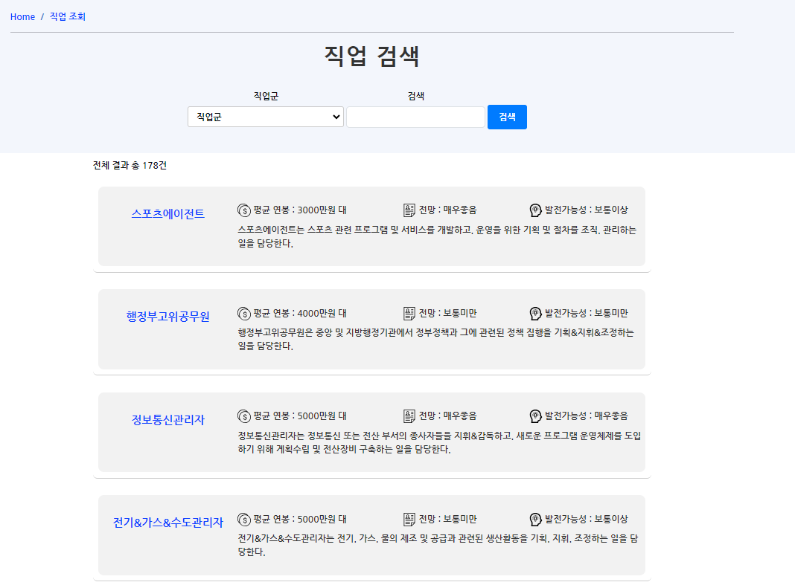
> 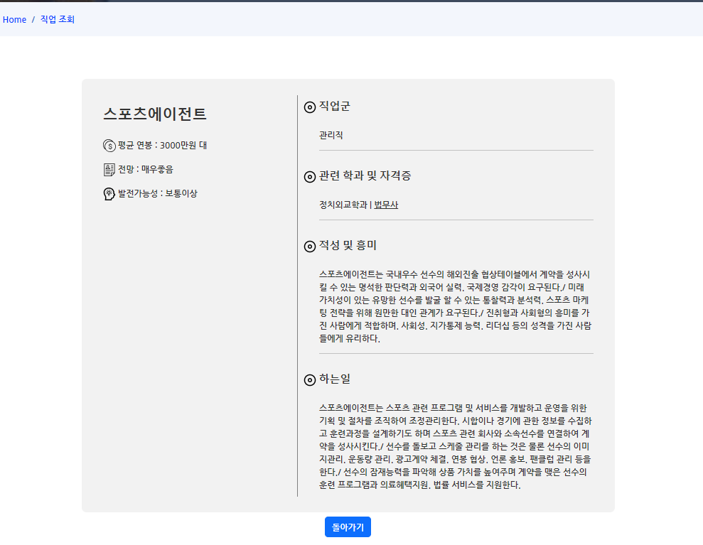
> - 자유 게시판  
> 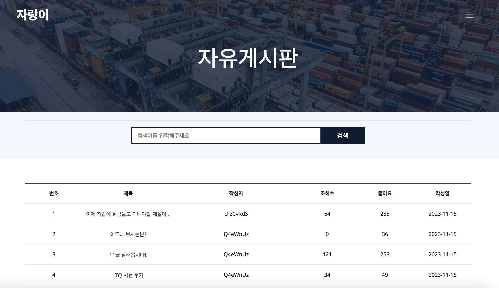
> 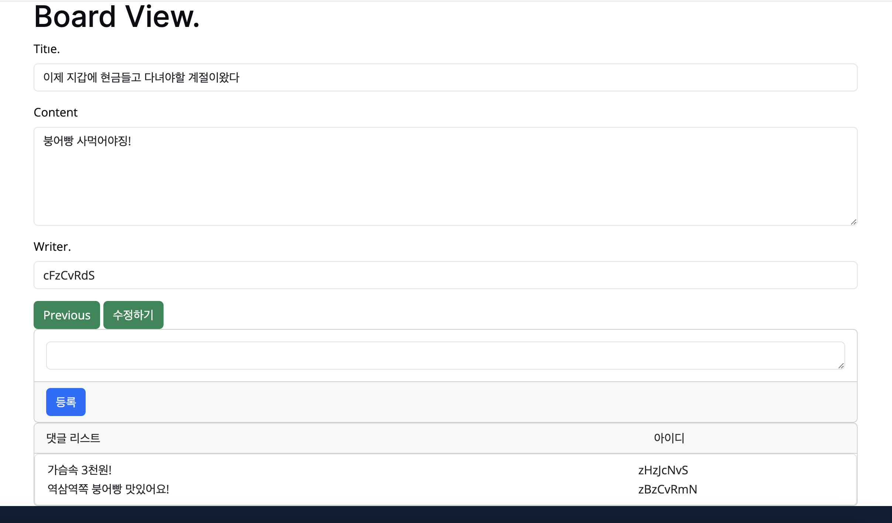
> - My페이지 스터디  
> 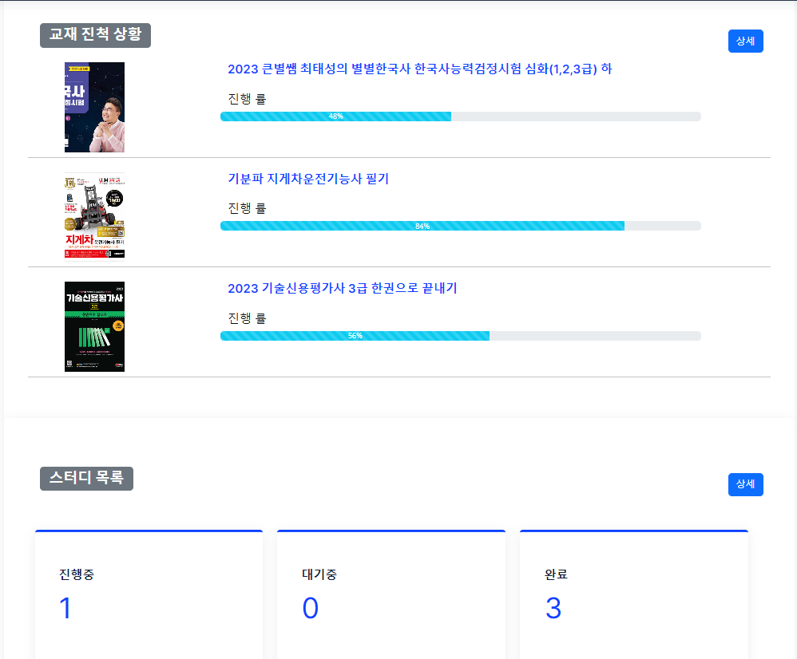
> 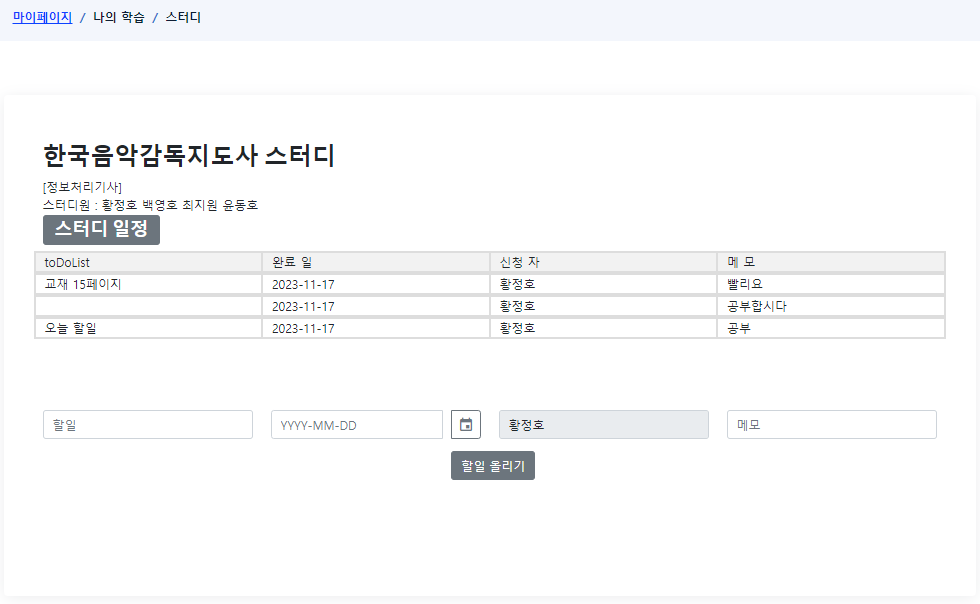

# 6. 기능 분석
> <strong>MVC Model</strong> 
>> - Model, View, Controller 세가지 구성 요소로 나누어 개발하는 방법
>> 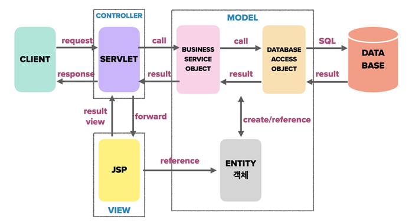

> <strong>Ajax</strong> 
>> - 웹 페이지에서 비동기적으로 서버와 통신하는 기술
>> 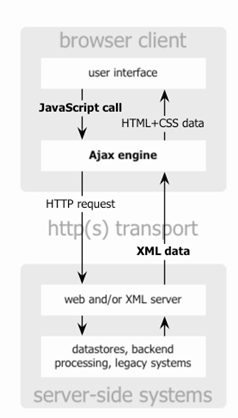

> <strong>Autocomplete</strong> 
>> - 사용자가 입력한 내용에 따라 자동 완성 기능을 제공하는 기능
>> 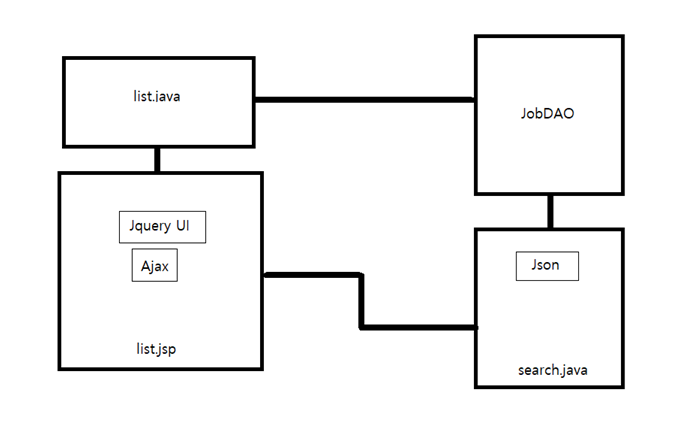

# 7. 📜세부 일정
> <strong>11월 13일 ~ 11월 20일</strong> 
>> - 요구 분석
>> - 순서도
>> - 화면 설계도
>> - ERD 

> <strong>11월 21일 ~ 11월 23일</strong> 
>> - 더미 데이터 
>> - 테이블 정의서 작성(DDL)
>> - 데이터 정의서 작성(DML) 

> <strong>11월 24일 ~ 11월 30일</strong> 
>> - 개발진행
>> - 데이터 통합 및 디버깅
>> - PPT 작성 

> <strong>12월 1일</strong> 
>> - 발표  
  
  # 핵심 트러블 슈팅

 <strong>1. BootStrap 사용법이 익숙치 않았다</strong> 

  - 부트스트랩으로 짜여있는 템플릿을 사용했는데 익숙하지 않아 사용하고 가공 하는데 어려움이 있었다. 클래스명칭으로 css처리를 할 수 있고 다양한 템플릿을 제공하여 쉽고 빠르게 view를 만들 수 있었다.  

 <strong>2. git 사용의 어려움이 있었다.</strong> 

  - 개인 브랜치 생성 후 main에 merge하는 방식으로 진행 했는데 servlet Controller의 명칭이 겹치는 부분이있어 일일이 확인 후 merge를 진행 했다.  

# 그 외 이슈

<strong>
  </strong> 

  

  
  

  
